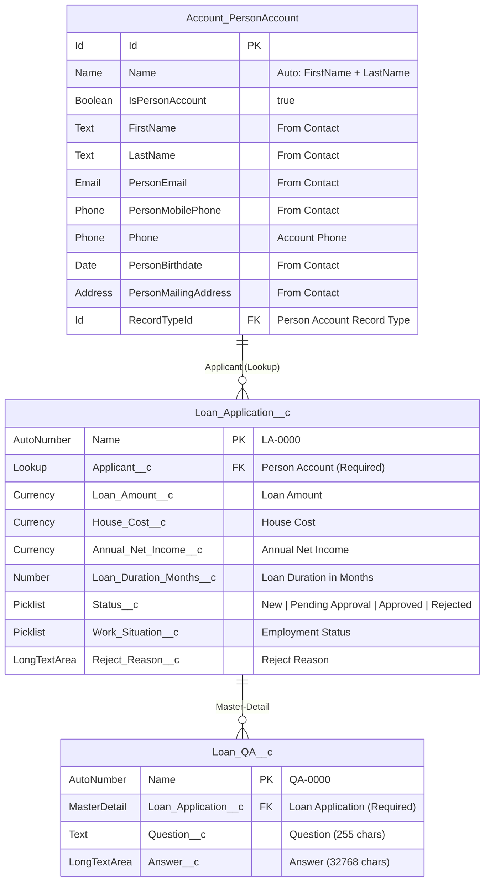

# FDE Bank - Entity Relationship Diagram

> **Salesforce DX Project** | API Version 66.0 | Person Account Model

---

## Table of Contents

- [Overview](#overview)
- [ERD Diagram](#erd-diagram)
- [Person Account Model](#person-account-model)
- [Object Reference](#object-reference)
  - [Account (Person Account)](#account-person-account)
  - [Loan_Application__c](#loan_application__c)
  - [Loan_QA__c](#loan_qa__c)
- [Relationships](#relationships)
- [Design Decisions](#design-decisions)

---

## Overview

The FDE Bank data model uses the **Salesforce Person Account** record type to represent individual banking customers. Person Accounts unify the standard Account and Contact objects into a single record, providing a streamlined 360-degree view of each applicant without managing separate Account-Contact pairings.

| Property | Value |
|---|---|
| **Record Model** | Person Account (Individual) |
| **Custom Objects** | Loan_Application__c, Loan_QA__c |
| **Namespace** | None |
| **API Version** | 66.0 |

---

## ERD Diagram

---

## Person Account Model

> **Important:** Person Accounts must be enabled at the org level. Once enabled, this setting cannot be reversed.

Person Accounts combine Account and Contact into a single record for individuals (B2C). In the FDE Bank context, each loan applicant is represented as a Person Account rather than a traditional Account + Contact pair.

### How It Works

| Aspect | Business Account | Person Account |
|---|---|---|
| **Represents** | Company / Organization | Individual Person |
| **Contact Required** | Yes (separate record) | No (merged into Account) |
| **Name Field** | Account Name (single field) | FirstName + LastName |
| **Contact Fields** | On related Contact record | Directly on Account (prefixed `Person*`) |
| **Record Type** | Business record types | Person Account record type |
| **IsPersonAccount** | `false` | `true` |

### Person Account Fields Available on Account

| API Name | Label | Source |
|---|---|---|
| `FirstName` | First Name | Contact.FirstName |
| `LastName` | Last Name | Contact.LastName |
| `PersonEmail` | Email | Contact.Email |
| `PersonMobilePhone` | Mobile Phone | Contact.MobilePhone |
| `PersonBirthdate` | Birthdate | Contact.Birthdate |
| `PersonMailingStreet` | Mailing Street | Contact.MailingStreet |
| `PersonMailingCity` | Mailing City | Contact.MailingCity |
| `PersonMailingState` | Mailing State | Contact.MailingState |
| `PersonMailingPostalCode` | Mailing Postal Code | Contact.MailingPostalCode |
| `PersonMailingCountry` | Mailing Country | Contact.MailingCountry |

---

## Object Reference

### Account (Person Account)

> **Standard Object** | Record Type: Person Account | `IsPersonAccount = true`

The Account object with Person Account record type serves as the primary customer record. Each applicant is a single Person Account record that holds both account-level and contact-level information.

| Property | Value |
|---|---|
| **Sharing Model** | Private (recommended for FSC) |
| **Record Type** | Person Account |
| **Name Format** | FirstName + LastName (auto-composed) |

---

### Loan_Application__c

> **Custom Object** | Label: Loan Application | Plural: Loan Applications

| Field API Name | Label | Type | Details |
|---|---|---|---|
| `Name` | Loan Application Name | AutoNumber | Format: `LA-{0000}` |
| `Applicant__c` | Applicant | Lookup(Account) | **Required** · Delete: Restrict · Points to Person Account |
| `Loan_Amount__c` | Loan Amount | Currency(18,2) | Requested loan amount |
| `House_Cost__c` | House Cost | Currency(18,2) | Property value |
| `Annual_Net_Income__c` | Annual Net Income | Currency(18,2) | Applicant's annual net income |
| `Loan_Duration_Months__c` | Loan Duration (Months) | Number(4,0) | Repayment period |
| `Status__c` | Status | Picklist | **New** (default), Pending Approval, Approved, Rejected |
| `Work_Situation__c` | Work Situation | Picklist | Employed Full-Time, Employed Part-Time, Self-Employed, Unemployed, Retired, Student |
| `Reject_Reason__c` | Reject Reason | LongTextArea(256) | Populated when Status = Rejected |

| Property | Value |
|---|---|
| **Sharing Model** | ReadWrite |
| **Deployment Status** | Deployed |
| **Features** | Activities, Feed Tracking, Search, Reports, Bulk API, Streaming API |

> **Note:** The `Contact__c` lookup field from the previous model is no longer needed. Person Account fields (email, phone, address) are accessed directly through the `Applicant__c` relationship.

---

### Loan_QA__c

> **Custom Object** | Label: Loan Q&A | Plural: Loan Q&As

| Field API Name | Label | Type | Details |
|---|---|---|---|
| `Name` | Loan Q&A Name | AutoNumber | Format: `QA-{0000}` |
| `Loan_Application__c` | Loan Application | MasterDetail(Loan_Application__c) | **Required** · Not Reparentable |
| `Question__c` | Question | Text(255) | Agent or user question |
| `Answer__c` | Answer | LongTextArea(32768) | Response content |

| Property | Value |
|---|---|
| **Sharing Model** | Controlled By Parent |
| **Deployment Status** | Deployed |
| **Features** | Search, Reports, Bulk API, Streaming API |

---

## Relationships

| # | Parent | Child | Type | Field | Relationship Name | Delete Behavior |
|---|---|---|---|---|---|---|
| 1 | Account (Person Account) | Loan_Application__c | Lookup (Required) | `Applicant__c` | `Loan_Applications` | Restrict |
| 2 | Loan_Application__c | Loan_QA__c | Master-Detail | `Loan_Application__c` | `Loan_QAs` | Cascade |

### Relationship Notes

- **Account &rarr; Loan_Application__c:** The `Applicant__c` lookup targets the Account object. When Person Accounts are enabled, this field resolves to Person Account records (where `IsPersonAccount = true`). No separate Contact lookup is needed.
- **Loan_Application__c &rarr; Loan_QA__c:** Master-Detail ensures Q&A records inherit the sharing model from the parent Loan Application and are cascade-deleted when the parent is removed.

---

## Design Decisions

| Decision | Rationale |
|---|---|
| **Person Account over Account + Contact** | Banking customers are individuals, not businesses. Person Accounts provide a single record per customer, simplifying data access and avoiding the need to join Account and Contact. |
| **Single Applicant lookup (no Contact__c)** | With Person Accounts, contact-level fields (email, phone, address) are available directly on the Account record via `Person*` prefixed fields. A separate Contact lookup becomes redundant. |
| **Master-Detail for Loan Q&A** | Q&A records have no meaning outside their parent Loan Application. Master-Detail enforces this lifecycle dependency and enables roll-up summaries if needed. |
| **Restrict delete on Applicant** | Prevents accidental deletion of a Person Account that has active loan applications, preserving data integrity. |
| **Flexible Q&A model** | Using a generic Question/Answer child object avoids schema changes when new qualification questions are added to the loan process. |
